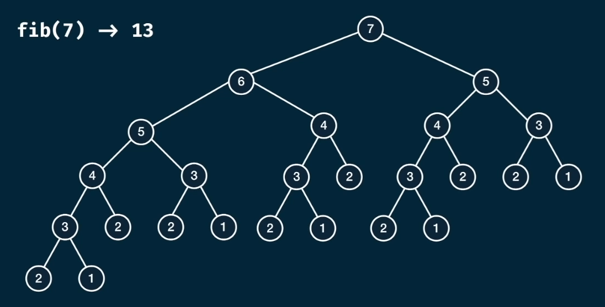
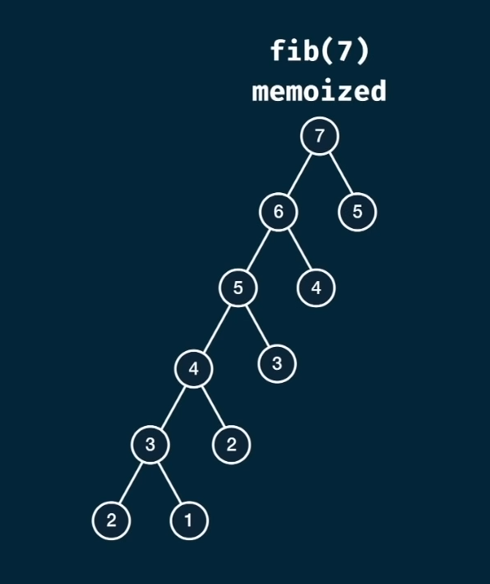

# Fibonacci Memoization
Write a function `fib(n)` that takes in a number as an argument.
The function should return the n-th number of the Fibonacci sequence.

Recall: The first and second element of the sequence is `1`. To generate the next number of the sequence, sum the two previous elements.
```
n:      1, 2, 3, 4, 5, 6,  7,  8,  9, ...
fib(n): 1, 1, 2, 3, 5, 8, 13, 21, 34, ...
```

Note: To best learn dynamic programming, we'll be using the recursive approach.

---

## A first pass of the `fib(n)` function
```javascript
const fib = (n) => {
    if (n <= 2) return 1;
    return fib(n-1) + fib(n-2);
}
```
While this function can compute, as the initial `n` value increases, the computation time increasing dramatically.
```
n:            1, 2, 3, 4,  5,  6,  7,   8, ...,     k
fib(n) calls: 1, 3, 7, 8, 15, 31, 63, 127, ..., k^2-1   
```



Dynamic Programming is about breaking down problems into subproblems and identifying patterns to introduce optimization techniques. With `fib(7)`, notice that the values `2, 3, 4, 5, 6, & 7` appear throughout the tree are being recomputed by our `fib(n)` function. Also notice that the left side sequence of `2-3-4-5-6-7` contains all the required values we need. Instead of recomputing, we can cache those values into a data structure with an $O(1)$ retrieval operation, a hashmap/dictionary.

With this approach of the problem, our complexities are:  
- Time Complexity: $O(2^n) \to O(n)$ where n is also the $H$, the height of the tree.  
- Space Complexity: $O(n) \to O(n)$ as we are still adding the same $H$ function calls to the Memory Stack. We are however, only reaching the $H$ level once with the cache.

```javascript
// JavaScript Objects are passed by reference so the memo object is not duplicated in memory
const fib = (n, memo={}) => {
    if (n in memo) return memo[n];
    if (n <= 2) return 1;
    memo[n] = fib(n-1, memo) + fib(n-2, memo);
    return memo[n];
}
```

By memoizing our approach and including it into our base case, we dramatically reduce our computations.
This can be visualized as:  
