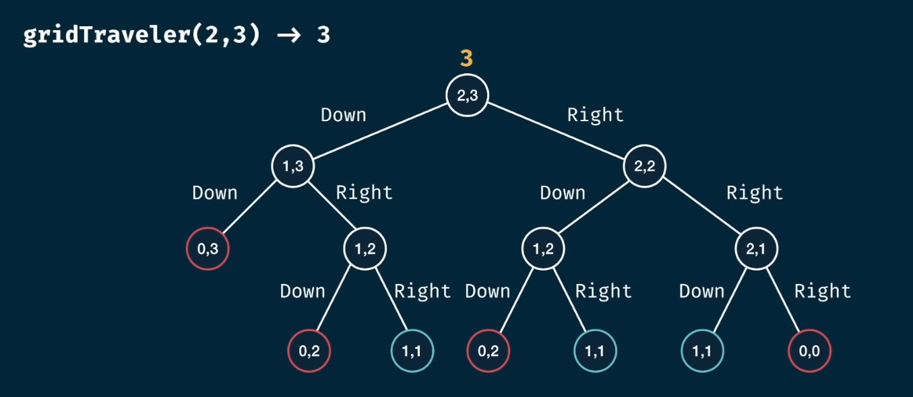

# Grid Traveler
Given an $m \times n$ grid, you begin in the top-left corner with the goal being to travel to the bottom-right corner. You may only move down or right. In how many ways can you travel to the goal with that grid?

```
gridTraveler(2,3) = 3

Grid:
-------------
| S |   |   |
-------------
|   |   | E |
-------------

Solutions:
1. right, right, down
2. right, down, right
3. down, right, right
```

Consider a $1 \times 1$ grid, the starting tile is the same as the ending tile. Therefore, the total numbers of possibilities to reach the end is $0$.  
Consider a $0 \times 0$, $u \times 0$, or a $v \times 0$ grid where $u,v \in \Z^+$, these grids would be considered invalid and should return $0$.

Notice that we can only move downwards or rightwards. Once we choose an option we change our grid to be $(m-1) \times n$ or $m \times (n-1)$. As we move through our grid, our grid field approaches $1 \times 1$ once we are on the bottom-right tile, represented as $(1,1)$. We can represent this as a tree structure:


```javascript
const travel = (m,n) => {
    if (m === 1 && n === 1) return 1;
    if (m === 0 || n === 0) return 0;
    return travel(m-1, n) + travel(m, n-1);
}
```

---


While this brute force approach can solve smaller $m \times n$ grids, it will quickly become slow.
This is due to the time complexity being $O(2^h)$, where $h=m+n$. The space complexity will be similar to [fib memoization](01-grid-traveler.md) where the space complexity is the height of the tree structure, $O(h)$.

Notice that there are repeating subtrees in our approach. We can apply memoization with a hashmap to avoid any recalculations. Further, the subtrees $(1,2)$ and $(2,1)$ are mirrored versions of each other. For sake of simplicity, this will not be implemented.

```javascript
const travel = (m, n, memo={}) => {
    const key = `${m},${n}`;
    if (key in memo) return memo[key];

    if (m === 1 && n === 1) return 1;
    if (m === 0 || n === 0) return 0;
    memo[key] = travel(m-1, n, memo) + travel(m, n-1, memo);
    return memo[key]
}
```

Note: With memoization, it is not good to `look before you leap` with your recursion as this will introduce complexity in your code. This should only be handled by the `memo` object or the base cases.

By memoizing our approach, our complexities have changed from:
- Time Complexity: $O(2^{m+n}) \to O(m \times n)$
- Space Complexity: $O(m+n) \to O(m+n)$

---

When attempting to solve dynamic programming problems with memoization, it is best to first approach them with brute-force for smaller arguments to narrow down the logic. After that, use memoization to cache the answers of the overlapping subproblems.