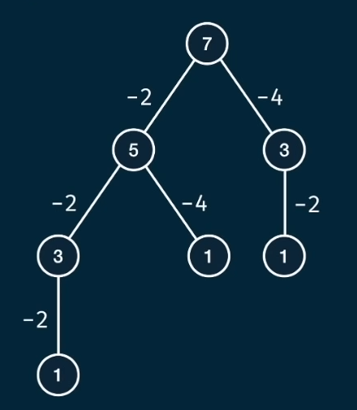

# CanSum
Write a function `canSum(targetSum, nums)` that takes in a targetSum and an array of numbers as arguments.   
The function should return a boolean indicating whether or not it is possible to generate the targetSum using numbers from the array.  
You may use an element of the array as many times as needed.  
You may assume that all input numbers are nonnegative.

## Examples
canSum(7, [5, 3, 4, 7]) $\to$ $true$ as you can either sum 3 and 4 or sum just 7.  
canSum(7, [2, 4]) $\to$ $false$ as there are no valid values that can sum to 7.

## Algorithm Approach
We can approach this problem as a decision tree with `targetSum` as the root, each edge being an argument of `nums`, and each node being the difference between the parent node and the edge. With this approach, we will consider two base cases to end the recursion:
- A resulting node with a value of $0$ indicates a valid summation of a collection of nums.
- A resulting node with a negative values indicates an invalid summation.



If we reach a base case of $0$, we will want to bubble up our result to have the $true$ value reach the original caller. We can accomplish this by using an $or$ statement.

## Initial Brute Force
```javascript
const canSum = (targetSum, nums) => {
    if (targetSum === 0) return true;
    if (targetSum <= 0) return null;
    
    for(let n of nums) {
        if (canSum(targetSum - n, nums)) {
            return true;
        }
    }
    return false;
}
```
With this brute force approach, our complexities are:
Time Complexity: $O(n^h)$ where $n$ is the length of `nums` and $h$ is the height of the tree.  
Space Complexity: $O(h)$

## Memoized Brute Force
```javascript
const canSum = (targetSum, nums, memo={}) => {
    if (targetSum in memo) return memo[targetSum];
    if (targetSum === 0) return true;
    if (targetSum <= 0) return false;

    for (let n of nums) {
        const remainder = targetSum - n;
        if (memo[remainder] === true) {
            memo[targetSum] = true;
            return true;
        }
    }

    memo[targetSum] = false;
    return false;
}
```

Note: When adding a `memo` object, there should be an equal amount of `memo` insertions as there are return statements.

With our `memo` object, our complexities shift to:
- Time Complexity: $O(n^h)$ $\to$ $O(h \times n)$
- Space Complexity: $O(m)$ $\to$ $O(m)$