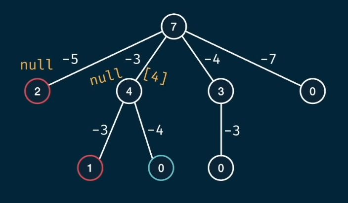

# HowSum
Write a function `howSum(targetSum, numbers)` that takes in a targetSum and an array of numbers as arguments.  
The function should return an array containing any combination of elements that add up to exactly the `targetSum`.  
If there is no combination that adds up to the targetSum, then return null.  
If there are multiple combinations possible, you may return any single one.

## Example
howSum(7,[5, 3,4, 7]) -> [3, 4] or [7]  
howSum(0, [1, 2, 3]) -> []  
howSum(7, [2, 4]) -> null

## Algorithm Approach
Similar to the [canSum](./04-can-sum.md) approach, we want every resulting decision path of $0$ to be a valid value and a negative value to be a invalid value.
With this problem, all invalid paths are now null while all valid paths are arrays.



## Brute force
```javascript
const howSum = (targetSum, number) => {
    if (targetSum === 0) return [];
    if (targetSum < 0) return null;

    for (let n of numbers) {
        const remainder = targetSum - num;
        const remainder_res = howSum(remainder, numbers);
        if (remainder_res !== null) {
            return [...remainder_res, n];
        }
    }

    return null;
}
```

Similar to [canSum](./04-can-sum.md), the time complexities are the same as we are only modifying our output.  
Time Complexity: $O(n^h)$ where $h$ is the height of the tree  
Space Complexity: $O(h)$

## Memoized
```javascript
const howSum = (targetSum, number, memo = {}) => {
    if (targetSum in memo) return memo[targetSum]
    if (targetSum === 0) return [];
    if (targetSum < 0) return null;

    for (let n of numbers) {
        const remainder = targetSum - num;
        const remainder_res = howSum(remainder, numbers);
        if (remainder_res !== null) {
            memo[targetSum] = [...remainder_res, n];
            return memo[targetSum];
        }
    }

    memo[targetSum] = null;
    return null;
}
```

Like the previous version of [canSum](./04-can-sum.md), the memoized version's Time Complexity is $O(n^h)$ where $h$ is the height of the tree. However, the Space Complexity is now $O(h^2)$ as for the height of the tree is also the length of the array. For that array, we will be storing keys for all the possible combinations as well.